# 📋 Practical Activities — Evidence Portfolio
> **GitHub:** [Coder-sus](https://github.com/Coder-sus) &nbsp;|&nbsp; **Repo:** [git-practical-activities](https://github.com/Coder-sus/git-practical-activities) &nbsp;|&nbsp; **University:** UTS &nbsp;|&nbsp; **Lectures:** 1–4

---

## 📑 Table of Contents
- [Lecture 1 — Git Fundamentals](#lecture-1--git-fundamentals)
- [Lecture 2 — GitHub Actions Workflow](#lecture-2--github-actions-workflow)
- [Lecture 3 — Custom Docker Action](#lecture-3--custom-docker-action)
- [Lecture 4 — Full CI/CD Pipeline](#lecture-4--full-cicd-pipeline)

---

## Lecture 1 — Git Fundamentals

### Activity 1 · Create and Initialize a Repository

Created a remote repository on GitHub, initialised a local repo, and linked them.

```bash
mkdir git-practical-activities && cd git-practical-activities
git init
git remote add origin https://github.com/Coder-sus/git-practical-activities.git
git remote -v
```

> 📸 **Screenshot 1.1** — Terminal showing `git remote -v` confirming the remote is linked

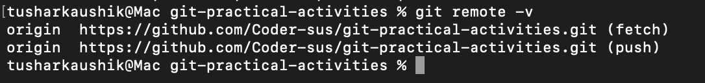

---

### Activity 2 · Clone and Associate a Repository

Cloned the repo, made an initial commit, pushed, then made a second commit to simulate the workflow.

```bash
git clone https://github.com/Coder-sus/git-practical-activities.git
echo "Hello GitHub" > README.md
git add README.md
git commit -m "Initial commit for git-practical-activities"
git push -u origin main
```

> 📸 **Screenshot 1.2** — GitHub showing the commit history with multiple commits

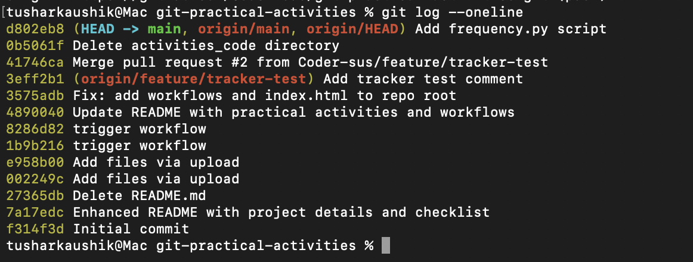

---

### Activity 3 · Branching and Merging

Created two feature branches, made changes on each, merged both back into main.

```bash
# Feature branch 1
git checkout -b feature-1
echo "<h2>Feature 1</h2>" > feature1.html
git add feature1.html && git commit -m "feature-1: Added feature1.html"
git push origin feature-1
git checkout main && git merge feature-1 && git push origin main

# Feature branch 2
git checkout -b feature-2
echo "<h2>Feature 2</h2>" > feature2.html
git add feature2.html && git commit -m "feature-2: Added feature2.html"
git push origin feature-2
git checkout main && git merge feature-2 && git push origin main
```

> 📸 **Screenshot 1.3** — GitHub Insights → Network graph showing the two branches and merges

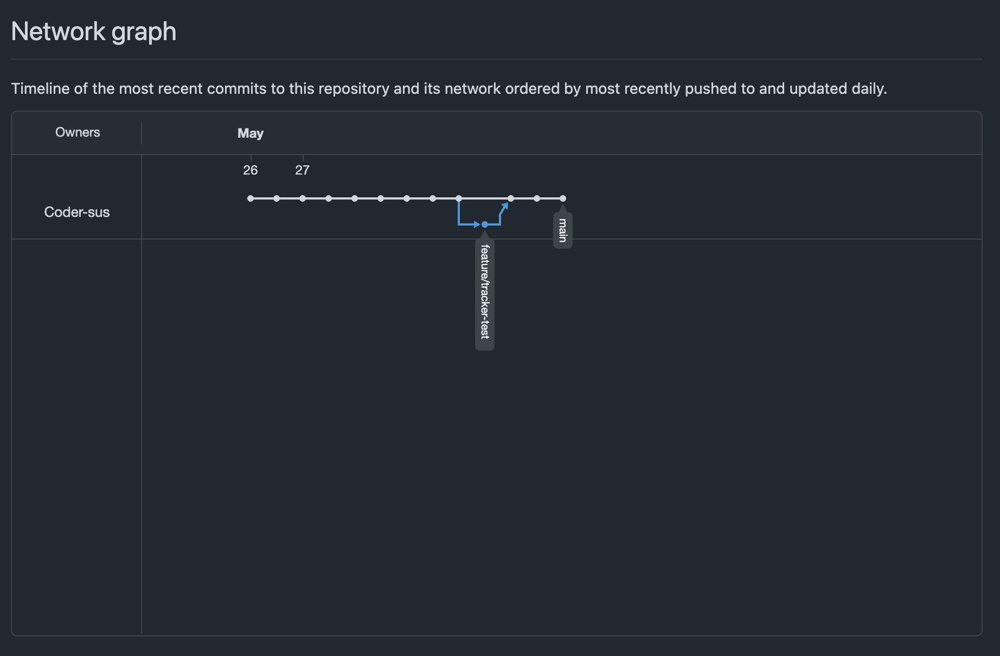

> 📸 **Screenshot 1.4** — Terminal `ls` showing all files present after merging

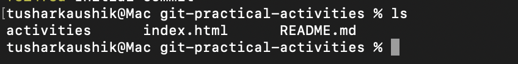

---

### Activity 4 · Amend, Revert, Reset & Fetch by Hash

```bash
# Amend
echo "<h1>Updated Title</h1>" > index.html && git add . && git commit -m "Initial commit with index.html"
echo "<p>Description added</p>" >> index.html && git add .
git commit --amend -m "Updated index.html with description"
git push origin main --force

# Revert
git log --oneline
git revert abcd123 && git push origin main

# Reset
git reset --hard 5678efg && git push origin main --force

# Checkout specific commit
git checkout cdef456   # detached HEAD
git checkout main
```

> 📸 **Screenshot 1.5** — Terminal `git log --oneline` showing the revert commit added to history

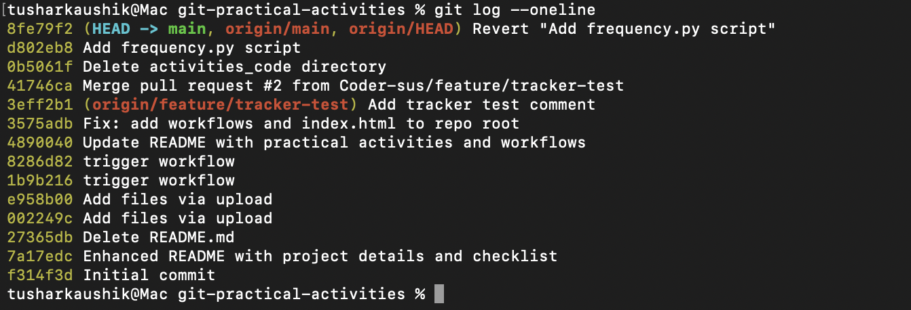

---

### Activity 5 · Rebase and Resolve Conflicts

Created two branches both modifying `index.html` to force a conflict, then rebased and resolved it manually.

```bash
git checkout branch-a
git fetch origin main && git rebase origin/main
# Resolve conflict markers in index.html, then:
git add index.html && git rebase --continue
git push origin branch-a --force
git checkout main && git merge branch-a && git push origin main
```

> 📸 **Screenshot 1.6** — Terminal showing Git conflict markers in the file

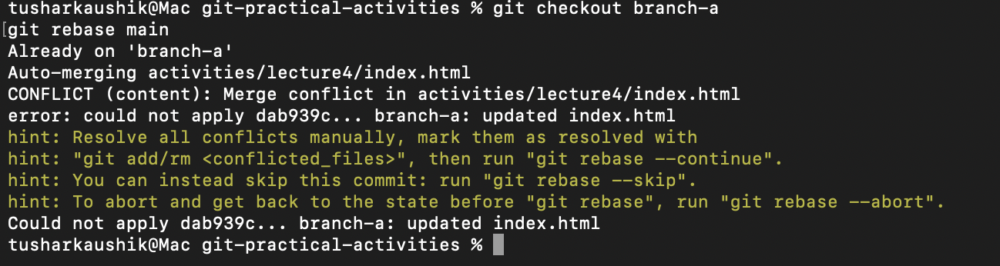

> 📸 **Screenshot 1.7** — Terminal showing `git rebase --continue` completing successfully

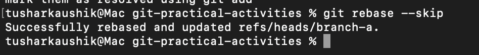

---

## Lecture 2 — GitHub Actions Workflow

### Activity 1 · Setup Workflow

Created `.github/workflows/main.yml` triggering on push to `main`.

```yaml
name: Collaborative Workflow
on:
  push:
    branches: [ main ]
jobs:
  update_html_and_readme:
    runs-on: ubuntu-latest
    steps:
      - name: Checkout Repository
        uses: actions/checkout@v3
```

> 📸 **Screenshot 2.1** — GitHub Actions tab showing `main.yml` listed

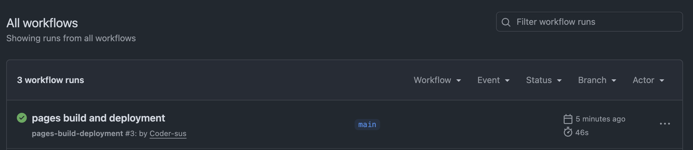

---

### Activity 2 · Configure update-HTML Step

Added Step 2: appends a timestamped `<p>` tag to `index.html` using the GitHub actor's username. Enabled GitHub Pages.

```yaml
- name: Update HTML
  run: |
    sed -i '/<\/body>/i <p>Updated by ${{ github.actor }} on '"$(date)"'</p>' index.html
```

> 📸 **Screenshot 2.2** — Settings → Pages showing GitHub Pages is enabled with the live URL

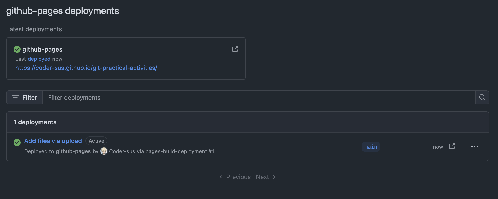

---

### Activity 3 · Configure update-README Step

Added Step 3: appends actor name, timestamp, and short commit hash to `README.md`.

```yaml
- name: Update README
  run: |
    echo "### Updated by ${{ github.actor }} on $(date '+%Y-%m-%d %H:%M:%S') [Commit: $(git rev-parse --short HEAD)]" >> README.md
```

> 📸 **Screenshot 2.3** — README.md on GitHub showing auto-appended log entries


---

### Activity 4 · Add commit-changes Step & Permissions

Added Step 4 to commit and push changes back. Set workflow permissions to Read & Write.

```yaml
- name: Commit and Push Changes
  run: |
    git config --global user.name "github-actions[bot]"
    git config --global user.email "github-actions[bot]@users.noreply.github.com"
    git add .
    git commit -m "Workflow: Updated HTML and README for ${{ github.actor }}" || echo "No changes to commit"
    git remote set-url origin https://x-access-token:${{ secrets.GITHUB_TOKEN }}@github.com/${{ github.repository }}
    git push origin main
  env:
    GITHUB_TOKEN: ${{ secrets.GITHUB_TOKEN }}
```

> 📸 **Screenshot 2.4** — Settings → Actions → General showing "Read and write permissions" selected

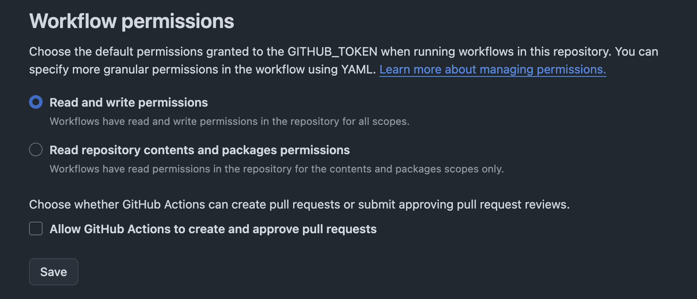

---

### Activity 5 · Test the Workflow

Pushed a change and verified the workflow ran correctly end-to-end.

> 📸 **Screenshot 2.5** — GitHub Actions run showing all 4 steps green

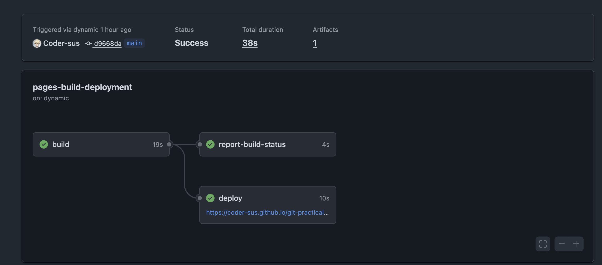

> 📸 **Screenshot 2.6** — GitHub Pages live site showing the `<p>` tag added by the workflow

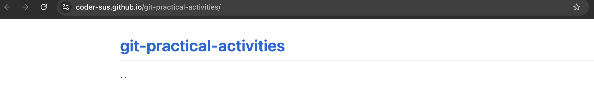

---

## Lecture 3 — Custom Docker Action

### Activities 1–2 · Scenario & Objectives

Built a custom GitHub Action using Docker to count vowel frequency in `data.txt` and append results with username and timestamp to `README.md`.

---

### Activity 3 · Project Structure

```
git-practical-activities/
├── README.md
├── Dockerfile
├── data.txt
├── .github/
│   ├── actions/vowel-frequency-analyzer/
│   │   └── action.yml
│   ├── workflows/
│   │   └── ci.yml
│   └── scripts/
│       ├── frequency.py
│       ├── update_readme.sh
│       └── entrypoint.sh
```

> 📸 **Screenshot 3.1** — GitHub repo file tree showing the above structure

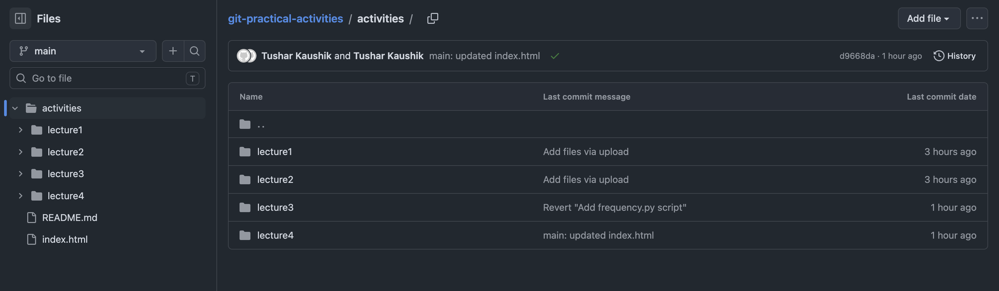

---

### Activity 4 · ci.yml

```yaml
- name: Build Docker image
  run: docker build -t vowel-frequency-analyzer:latest .
- name: Run Docker container
  run: |
    docker run --rm \
      -e GITHUB_USER="${{ github.actor }}" \
      vowel-frequency-analyzer:latest
```

---

### Activity 5 · action.yml

```yaml
name: 'Vowel Frequency Analyzer'
runs:
  using: 'docker'
  image: 'ghcr.io/Coder-sus/vowel-frequency-analyzer:latest'
  entrypoint: ['/bin/bash', '/github/scripts/entrypoint.sh']
  env:
    FILE: ${{ inputs.file }}
```

---

### Activity 6 · frequency.py — Verified Output

```python
from collections import Counter

def count_vowels(file_path):
    vowels = "aeiou"
    with open(file_path, 'r') as file:
        text = file.read().lower()
    return Counter(char for char in text if char in vowels)
```

**Verified output:**
```
Counter({'e': 20, 'a': 18, 'i': 15, 'o': 13, 'u': 11})
```

> 📸 **Screenshot 3.2** — Terminal showing `python3 frequency.py data.txt` with Counter output

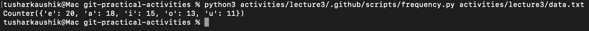

---

### Activities 7–8 · update_readme.sh & entrypoint.sh

> 📸 **Screenshot 3.3** — README.md on GitHub after a workflow run showing the appended vowel frequency log entry

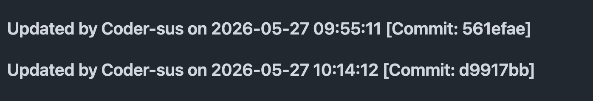

---

### Activity 9 · Dockerfile

```dockerfile
FROM python:3.9-slim
WORKDIR /app
RUN apt-get update && apt-get install -y git && apt-get clean
COPY . .
RUN chmod +x /app/.github/scripts/entrypoint.sh
ENTRYPOINT ["/bin/bash", "/app/.github/scripts/entrypoint.sh"]
```

> 📸 **Screenshot 3.4** — GitHub Actions run showing Docker build and run steps green

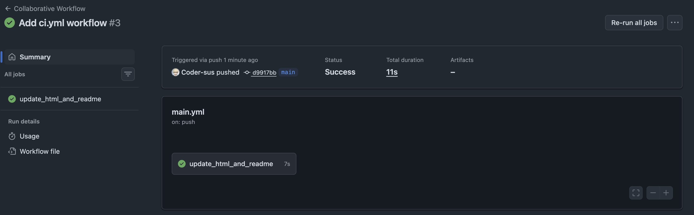

---

## Lecture 4 — Full CI/CD Pipeline

### Activity 3 · todo.py — Verified Output

```
ToDo Tasks:
Implement login feature
Deploy to staging
Code review
Done Tasks:
Design database schema
Set up CI/CD pipeline
Write unit tests
```

> 📸 **Screenshot 4.1** — Terminal showing `python3 todo.py` output

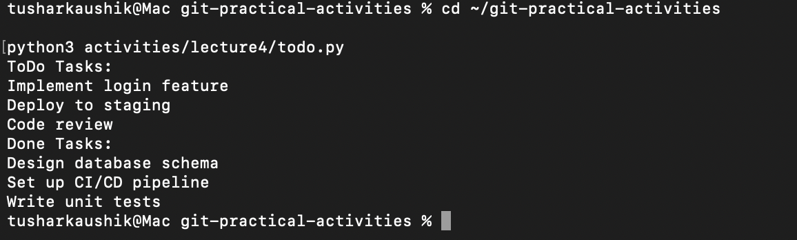

---

### Activity 4 · todo-test.py — All Tests Pass

```
test_add_task ... ok
test_get_done_tasks ... ok
test_get_open_tasks ... ok

All tests passed!
```

> 📸 **Screenshot 4.2** — Terminal showing `python3 todo-test.py` with all 3 tests passing

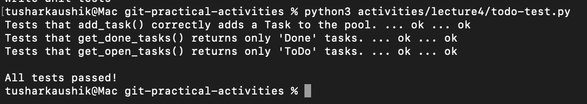

---

### Activities 5–7 · update_index.sh, entrypoint.sh, Dockerfile

> 📸 **Screenshot 4.3** — Browser showing `index.html` with updated ToDo tasks, Done tasks, and test results

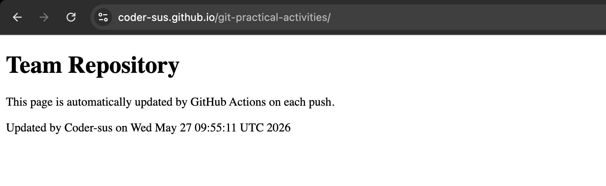

---

### Activity 8 · ci.yml

```yaml
- name: Build the Docker Image
  run: docker build -t task-manager:latest .
- name: Run the Docker Image
  run: docker run --rm -e GITHUB_USER="${{ github.actor }}" task-manager:latest
```

---

### Activity 9 · tracker.yml — Issue Automation

Triggers on PR close. If merged, extracts `Closes #N` from the PR body and labels the issue as "done".

> 📸 **Screenshot 4.4** — GitHub issue showing the "done" label applied automatically after PR merge

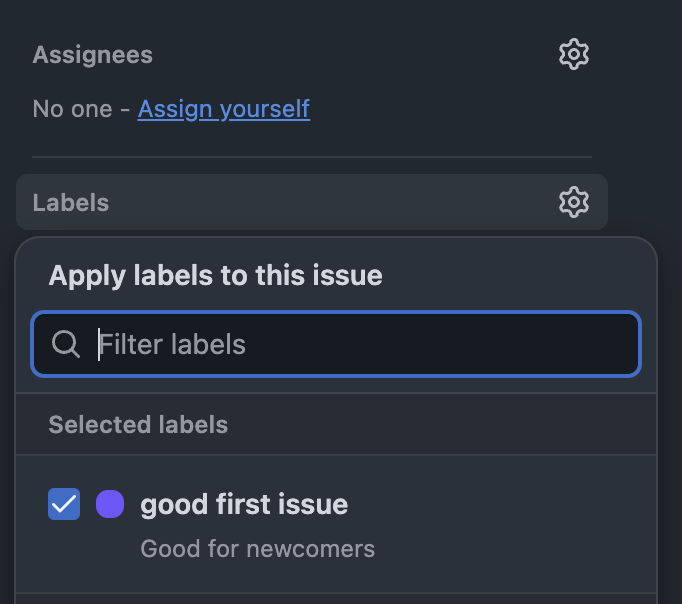

---

### Activity 10 · Testing the Full CI/CD Pipeline

| Step | Action | Result |
|------|--------|--------|
| 1 | Created GitHub Project board with "To Do" column | ✅ |
| 2 | Created issue, labelled & assigned to self | ✅ |
| 3 | Created local branch, committed, pushed | ✅ |
| 4 | Created PR with `Closes #N` in description | ✅ |
| 5 | Merged PR → `ci.yml` triggered (Docker build & run) | ✅ |
| 6 | Merged PR → `tracker.yml` triggered (issue labelled done) | ✅ |
| 7 | `index.html` updated with latest task & test data | ✅ |

> 📸 **Screenshot 4.5** — GitHub Project board showing the issue moved to "Done"

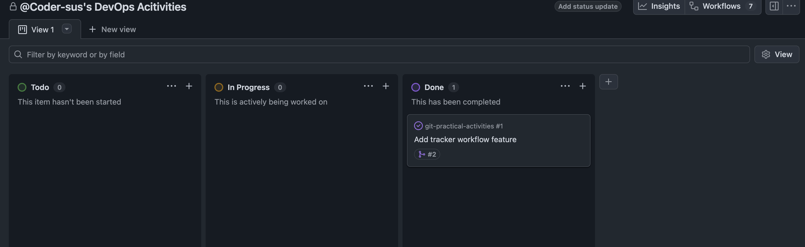

> 📸 **Screenshot 4.6** — GitHub Pull Request showing `Closes #N` in the description

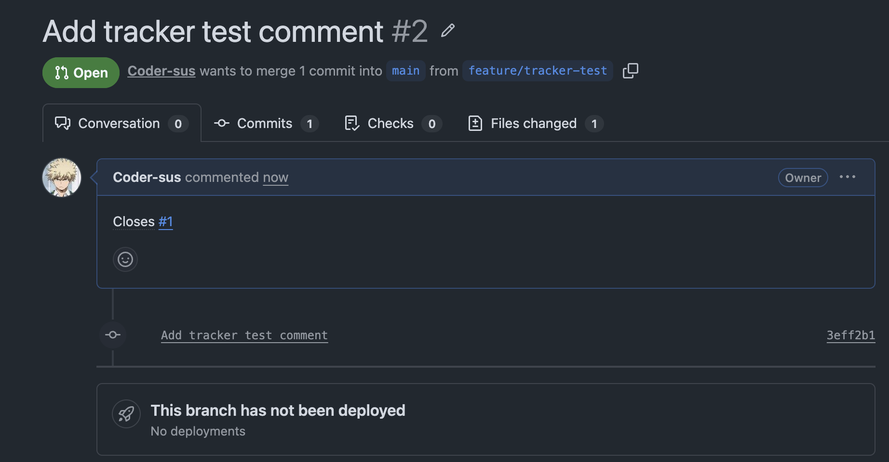

> 📸 **Screenshot 4.7** — GitHub Actions tab showing `ci.yml` and `tracker.yml` both green after merge

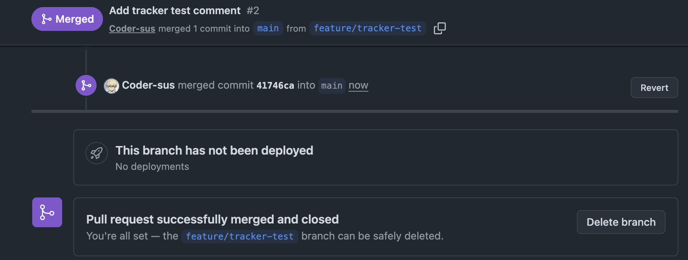

---

*Evidence portfolio for UTS DevOps practical activities — [Coder-sus](https://github.com/Coder-sus)*
